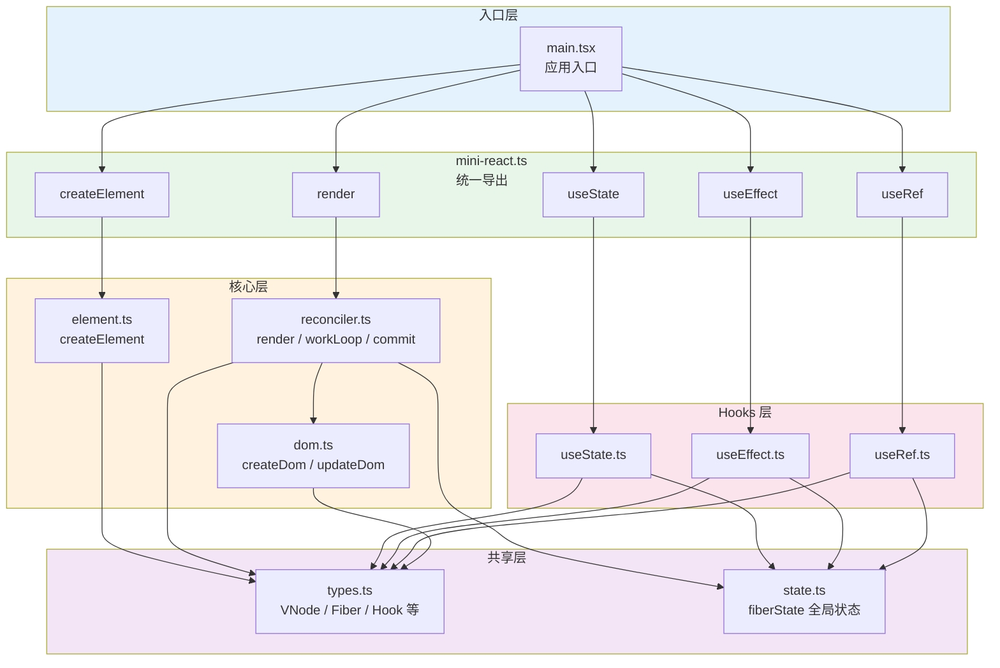
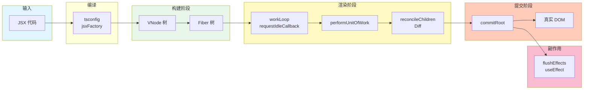
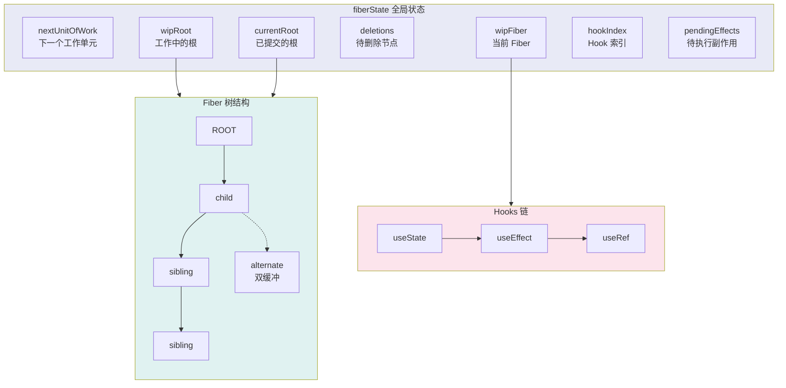

# MiniReact 当前架构图

## 1. 模块依赖关系



## 2. 数据流与渲染流程



## 3. Fiber 树与状态管理



## 4. 文件结构总览

```
src/
├── main.tsx                 # 应用入口，使用 MiniReact
└── mini-react/
    ├── mini-react.ts       # 统一导出
    ├── types.ts            # 类型定义 (VNode, Fiber, Hook, Effect, RefObject)
    ├── state.ts            # fiberState 全局状态
    ├── element.ts          # createElement → VNode
    ├── dom.ts              # createDom, updateDom (属性/事件/ref)
    ├── reconciler.ts       # render, workLoop, performUnitOfWork, reconcileChildren, commitRoot
    ├── useState.ts         # 状态 Hook
    ├── useEffect.ts        # 副作用 Hook
    ├── useRef.ts           # 引用 Hook
    └── jsx.d.ts            # JSX 类型声明
```

## 5. 核心概念速览

| 概念 | 说明 |
|------|------|
| **VNode** | 虚拟 DOM 节点，由 createElement 创建 |
| **Fiber** | 工作单元，带 parent/child/sibling 链表结构，支持可中断 |
| **alternate** | 双缓冲，连接当前树与上一次提交的树 |
| **workLoop** | 使用 requestIdleCallback 在空闲时执行，时间切片 (5ms) |
| **effectTag** | PLACEMENT / UPDATE / DELETION，标记 DOM 操作类型 |
| **fiberState** | 全局单例，存储调度与 Hooks 所需状态 |
