# MiniReact 详细流程图

## 1. 整体架构流程

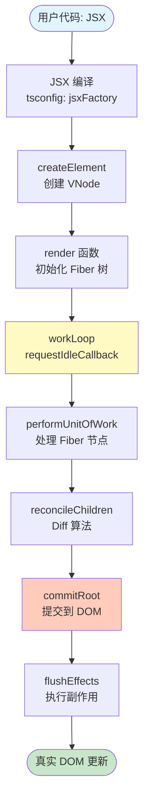

## 2. JSX 编译与 VNode 创建

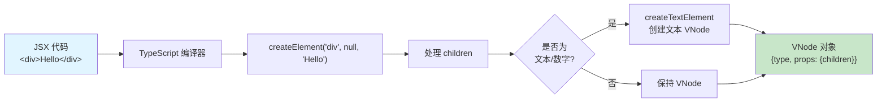

## 3. Fiber 工作循环 (核心调度)

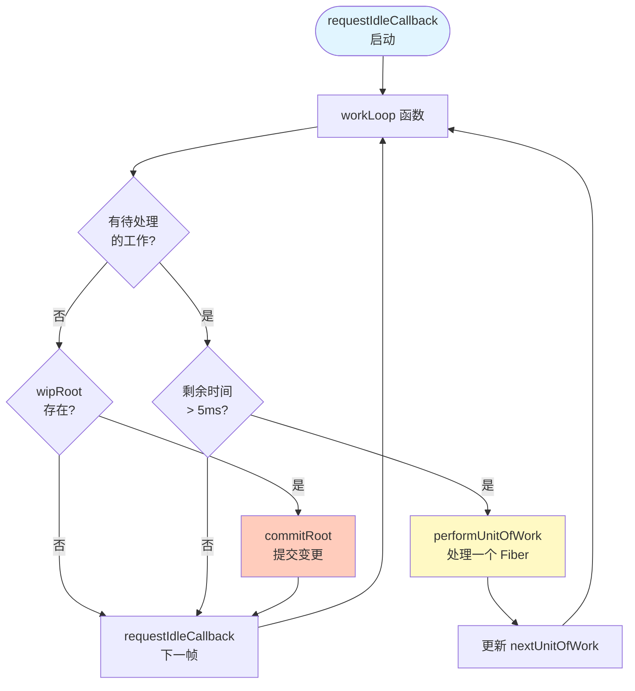

## 4. performUnitOfWork 详细流程

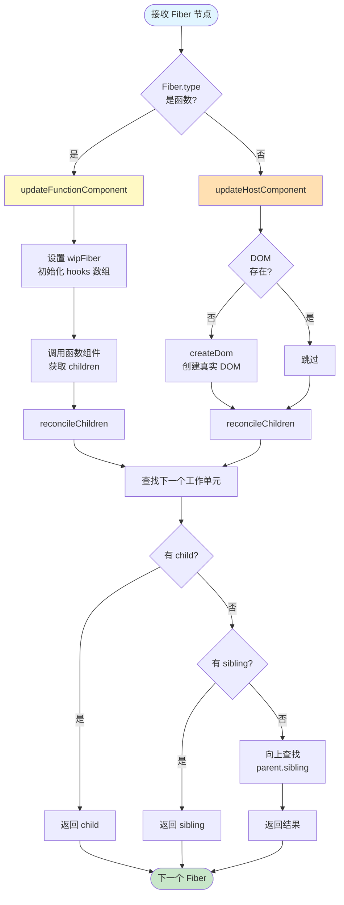

## 5. reconcileChildren (Diff 算法)

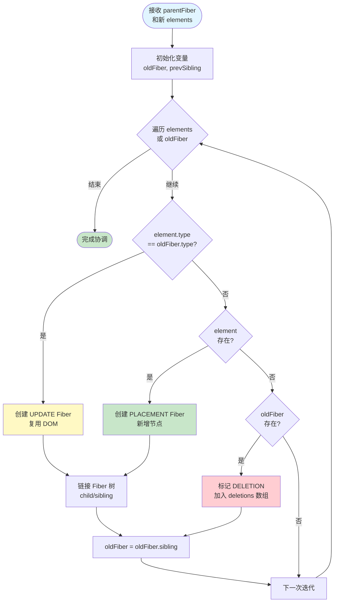

## 6. commitRoot 提交阶段

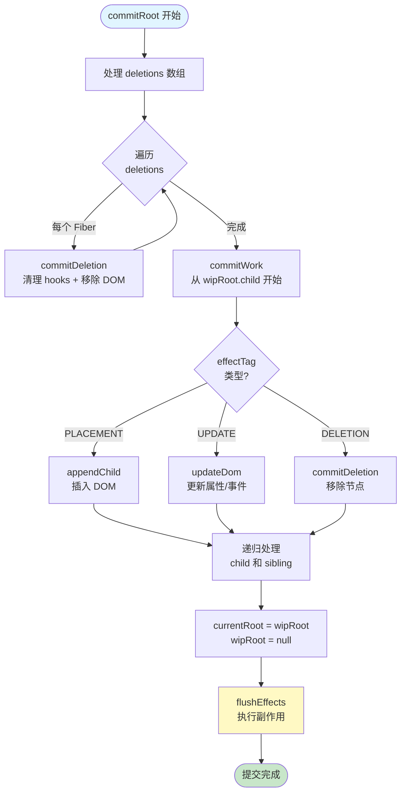

## 7. useState Hook 流程

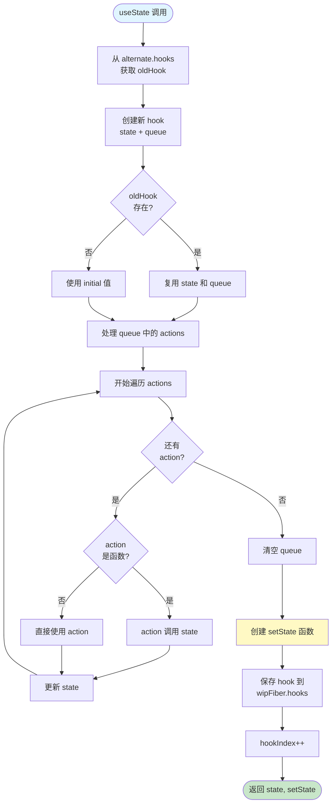

### setState 调用流程

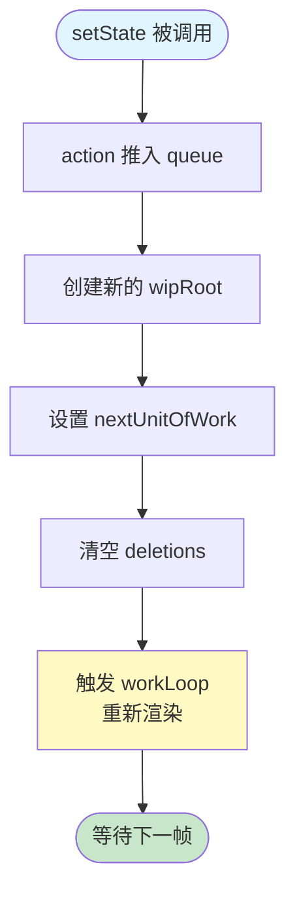

## 8. useEffect Hook 流程

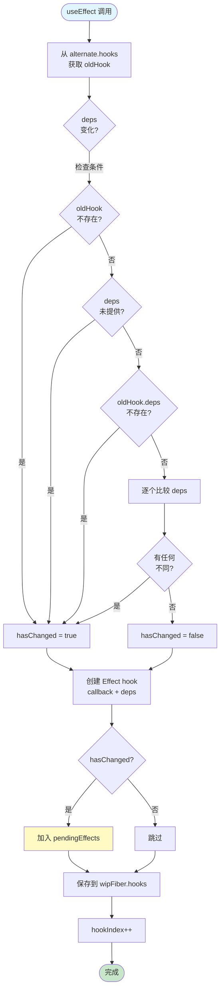

### flushEffects 执行流程

```mermaid
flowchart TD
    Start([flushEffects 调用]) --> CleanupPhase[第一阶段: 清理]
    CleanupPhase --> LoopStart1[开始遍历 pendingEffects]
    LoopStart1 --> HasMore1{还有<br/>effect?}
    HasMore1 -->|是| HasCleanup{cleanup<br/>存在?}
    HasCleanup -->|是| RunCleanup[执行 cleanup()]
    HasCleanup -->|否| Skip1[跳过]
    RunCleanup --> LoopStart1
    Skip1 --> LoopStart1

    HasMore1 -->|否| EffectPhase[第二阶段: 执行]
    EffectPhase --> LoopStart2[开始遍历 pendingEffects]
    LoopStart2 --> HasMore2{还有<br/>effect?}
    HasMore2 -->|是| RunCallback[执行 callback()]
    RunCallback --> CheckReturn{返回值<br/>是函数?}
    CheckReturn -->|是| SaveCleanup[保存为 cleanup]
    CheckReturn -->|否| Skip2[跳过]
    SaveCleanup --> LoopStart2
    Skip2 --> LoopStart2

    HasMore2 -->|否| Clear[清空 pendingEffects]
    Clear --> End([完成])

    style Start fill:#e1f5ff
    style End fill:#c8e6c9
    style CleanupPhase fill:#ffcdd2
    style EffectPhase fill:#c8e6c9
```

## 9. DOM 操作流程

### createDom

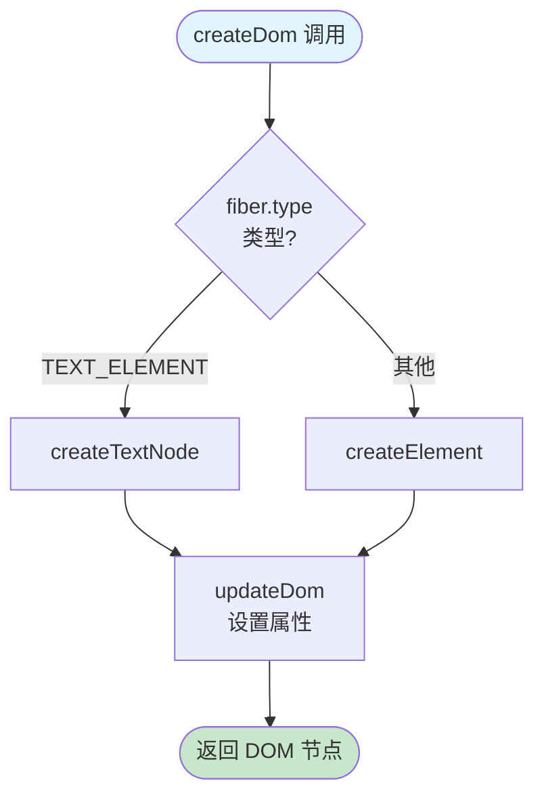

### updateDom

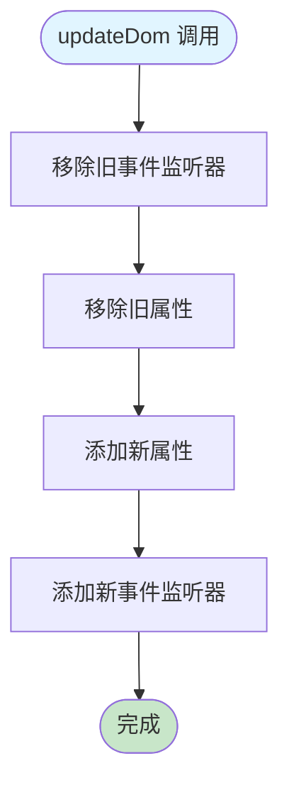

## 10. 完整渲染流程时序图

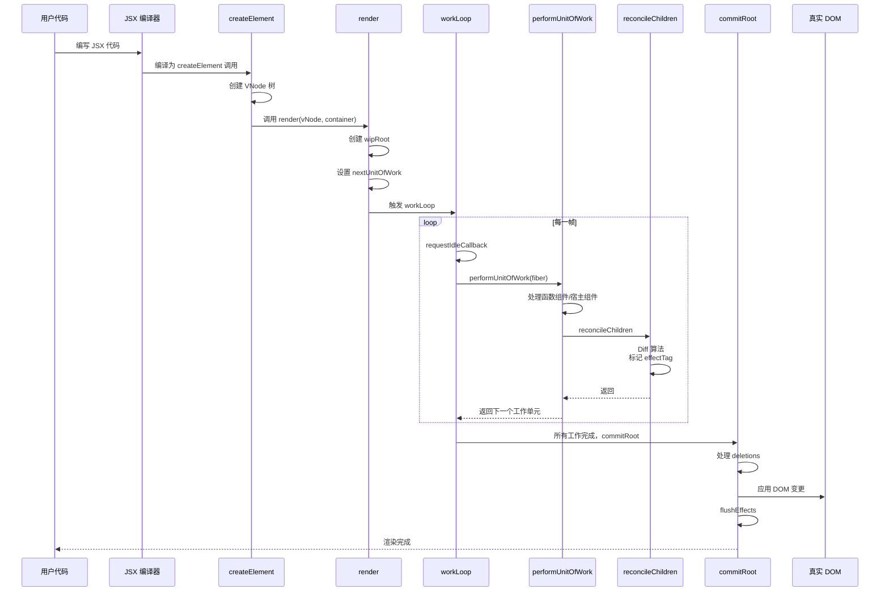

## 11. 状态更新流程时序图

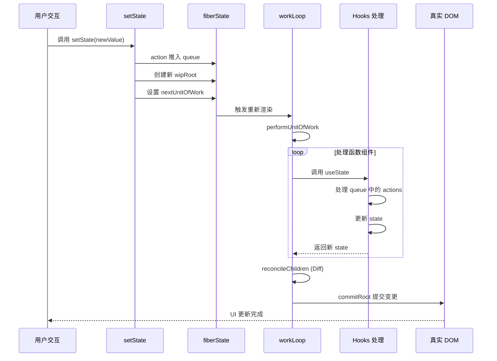

## 12. 核心数据结构

### VNode (虚拟 DOM)

```typescript
interface VNode {
  type: string | FC;           // 元素类型或函数组件
  props: {
    children: VNode[];         // 子节点数组
    [key: string]: any;        // 其他属性
  };
}
```

### Fiber (工作单元)

```typescript
interface Fiber {
  type: string | FC;           // 类型
  props: { ... };              // 属性
  dom?: HTMLElement | Text;    // 真实 DOM 引用
  parent?: Fiber;              // 父节点
  child?: Fiber;               // 第一个子节点
  sibling?: Fiber;             // 兄弟节点
  alternate?: Fiber;           // 上一次的 Fiber
  effectTag?: "PLACEMENT" | "UPDATE" | "DELETION";  // 操作标记
  hooks?: (Hook | Effect)[];   // Hooks 数组
}
```

### fiberState (全局状态)

```typescript
const fiberState = {
  nextUnitOfWork: Fiber | null;    // 下一个工作单元
  wipRoot: Fiber | null;            // 工作中的根节点
  currentRoot: Fiber | null;        // 当前渲染的根节点
  deletions: Fiber[];               // 待删除的节点
  wipFiber: Fiber | null;           // 当前工作的 Fiber
  hookIndex: number;                // 当前 Hook 索引
  pendingEffects: Effect[];         // 待执行的副作用
};
```

## 13. 关键设计要点

### 1. Fiber 架构
- **可中断渲染**: 使用 `requestIdleCallback` 在浏览器空闲时执行
- **时间切片**: 每帧检查剩余时间 (`timeRemaining() < 5ms`)
- **双缓冲**: `wipRoot` (工作中) 和 `currentRoot` (已提交)

### 2. Diff 算法
- **同层比较**: 只比较同一层级的节点
- **类型判断**: `element.type === oldFiber.type` 决定复用或重建
- **effectTag 标记**: PLACEMENT (新增) / UPDATE (更新) / DELETION (删除)

### 3. Hooks 实现
- **顺序依赖**: 通过 `hookIndex` 保证 Hooks 调用顺序
- **状态持久化**: 通过 `alternate` 链接保存上一次的状态
- **批量更新**: `useState` 的 queue 机制

### 4. 提交阶段
- **两阶段提交**:
  1. Render 阶段 (可中断): 构建 Fiber 树，标记变更
  2. Commit 阶段 (不可中断): 一次性应用所有 DOM 变更
- **副作用管理**: 先执行清理，再执行新副作用

---

## 总结

MiniReact 实现了 React 的核心机制：

1. ✅ **JSX 编译** → VNode 创建
2. ✅ **Fiber 架构** → 可中断渲染
3. ✅ **Diff 算法** → 高效更新
4. ✅ **Hooks** → useState, useEffect
5. ✅ **调度器** → requestIdleCallback
6. ✅ **提交阶段** → DOM 批量更新

这个实现涵盖了 React 面试中最常考察的核心概念！
```

